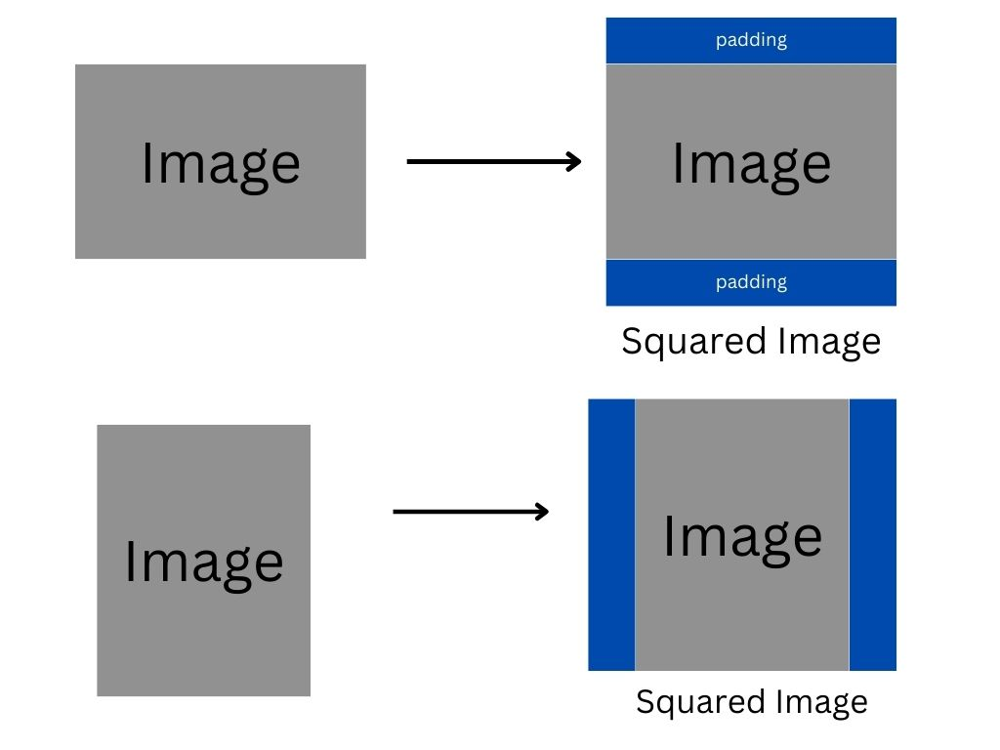
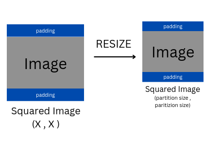

# Image Grid Generator

## Approach  

The approach involves defining several functions:

1. **make_square**:

 Converts rectangular images into square images by adding black or white padding.




2. **Grid parameters**: 

The grid size is based on the partition size we choose, it represents the size of each grid inside the whole combined image.


3. **resize**  

Now once we have the squared image, we resize it to match the partition size.

 
4. **Grid Formation**

Once we have all the images having height and width equal to parition size, we merge them into the grid.


## Running the code

Put all the images to be made into Collage inside a directory, pass the directory to function `load_images_from_directory()`

This function returns the image list which should be passed to `make_grid` function.

**Sample Code**

```python
# Directory where the images are stored
directory_path = "/home/swodesh/Documents/EKbana/swodeshsharma/Task15_Image_grid/image_grid"
images_list = load_images_from_directory(directory_path)
img = make_grid(images_list,3,4,1000,background_color= "white")
cv2.imwrite("grid_image.jpeg",img)
img = cv2.cvtColor(img,cv2.COLOR_BGR2RGB)
plt.imshow(img)
plt.axis('off')  # Turn off axis
plt.show()
```

**make_grid parameters**
```
a list containing images in numpy array  
number of row in a grid  
number of column in a grid  
partition size : size of each individual grid inside the image in pixel  
background color : "white" or "black"  
```


## Demo

### Demo 1

```python
make_grid(images_list,3,4,1000,background_color= "white")
```


### Demo 2
**With black Background**

```python
make_grid(images_list,4,2,1000,background_color= "black")
```


## ***All the codes are present in notebook attached***

